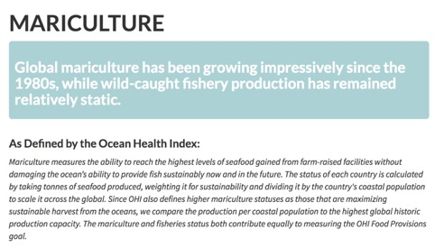
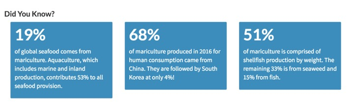

background-image: url(img/fish-background.jpg)
background-size: cover

```{r setup, include=FALSE}
options(htmltools.dir.version = FALSE)

## For installing xaringan 
#devtools::install_github('yihui/xaringan') 
```

---
name: toc

# Table of Contents

1. [Overview of Global Dashboard](https://mazu.nceas.ucsb.edu/rstudio/files/github/global-dashboard/slidedeck/modules_slidedeck.html#overview)
2. [Structure of Repository](https://mazu.nceas.ucsb.edu/rstudio/files/github/global-dashboard/slidedeck/modules_slidedeck.html#structure)
3. [User Interface](https://mazu.nceas.ucsb.edu/rstudio/files/github/global-dashboard/slidedeck/modules_slidedeck.html#ui)

---
name: overview

# Overview of Global Dashboard

The global dashboard was created to provide OHI Global users a way to explore the data that went into calculating each of the 10 goals. 

<br>

In these slide decks I walk through the general structure of the global-dashboard repository. There are short tutorial videos at the end of each section as well if you'd rather not read.

---
name: structure
class: middle, center

# Structure of Repository

Main Components
<br>
Folders


---
name: main

# Main Components

**The UI and Server are best friends and without telling them both that you want to create something, such as a map, your map will not generate.**
* **ui.R**: _User interface for the shiny app, including layout and text elements_
* **server.R**: _Server for shiny app, where you add custom, interactive charts and maps for each goal_

<br><br>

To wrangle your data so that it's ready to visualize for the next OHI goal, you want to create a script for your OHI goal, like fis.R, clean_waters.r, or bio.r:
* **dataprep** folder: _Prepare data for each goal to be plotted or mapped here. Each goal will have it's own script_


.footnote[Back to [Table of Contents](https://mazu.nceas.ucsb.edu/rstudio/files/github/global-dashboard/slidedeck/modules_slidedeck.html#3)]
---
name: folders

# Folders

* **global.R**: _Stores global variables and settings that will be used in the UI and server_
* functions: _Functions to replicate pieces of the dashboard that are infrequently modified_
* int: _Data tables stored from the dataprep scripts_
* modules: _Collection of functions that allow for customization of maps and graphs across goals_
* rsconnect: _You can ignore this_
* slidedeck: _Folder that contains everything that made this slide deck_
* test: _Scripts for testing code to plot, graph, etc_
* www: _The CSS/HTML customization and images_

.footnote[Back to [Table of Contents](https://mazu.nceas.ucsb.edu/rstudio/files/github/global-dashboard/slidedeck/modules_slidedeck.html#3)]
---
name: ui
class: middle, center

# User Interface (ui.R)
Adding a New Tab in the Sidebar
<br>
Contents within Tabs

---

## Adding a New Tab in the Sidebar

Currently there are only two tabs: "The OHI Story" and "Mariculture". Uncomment and edit corresponding `menuItem`s to create a tab section in the side bar.
```
  dashboardSidebar(
    
    sidebarMenu(
      menuItem("The OHI Story", tabName = "dashboard", icon = icon("globe", lib="glyphicon")),
     
      # menuItem("Livelihoods & Economies", tabName = "liveco"),
      # menuItem("Tourism & Recreation", tabName = "tr"),
      # menuItem("Biodiversity", tabName = "bio"),
      # menuItem("Sense of Place", tabName = "sop"),
      # menuItem("Artisanal Opportunities", tabName = "ao"),
      # menuItem("Food Provision", tabName = "fp"),
      
      menuItem("Mariculture", tabName = "mar")
      
      #,
      # menuItem("Fisheries", tabName = "fis"),
      # menuItem("Coastal Protection", tabName = "cp"),
      # menuItem("Carbon Storage", tabName = "cs")
  )
```

.footnote[Back to [Table of Contents](https://mazu.nceas.ucsb.edu/rstudio/files/github/global-dashboard/slidedeck/modules_slidedeck.html#3)]
---

## Contents within Tabs

Inside `tabItems` is where you define the text and layout for each `tabItem`. Currently we just have a `tabItem` for the home page and one for the Mariculture sub-goal. 

Each OHI goal `tabItem` can have a `tab_title_ui()`, `summary_stats_ui()`, `map_ui()`, and a `card_ui()`. I simplified the code so you can see all the individual elements. Three of these are modules, and one of them is just a stand alone function (see Modules). See outputs on the next page.

```
tabItems(
 ## Mariculture ##
    tabItem(tabName = "mar",
          ## Mariculture Tab Title ##
          tab_title_ui(),
        
          ## Mariculture Baseline Metrics ##
          summary_stats_ui(),
                
          ## Mariculture Global Map
          map_ui(),
          
          ## Annual Mariculture Production ##
          card_ui()
          )
)
```

.footnote[Back to [Table of Contents](https://mazu.nceas.ucsb.edu/rstudio/files/github/global-dashboard/slidedeck/modules_slidedeck.html#3)]
---

.pull-left[
`tab_title`
<br>


<br>

`card`
<br>

]

.pull-right[
`map`
<br>


<br>

`summary_stats`
<br>

]

---
name:ui_notes

# Notes about UI

* The UI only creates the layout, sets the text for the content, you'll need to define matching module functions in the server for the outputs to be created
* You can create as many cards, maps, baseline metrics, and title sections as you want, but I tend to avoid cluttering the shiny dashboard, so you can direct the user's attention towards specific visuals without overwhelming them
* The four different elements you just saw are created by 4 different modules. Each module has a ui function as well as a server function. Without both, you can't create the outputs you just saw in the previous slide

---
name: ui_video

# Demo Video

Check back soon for the UI video!

---
name: server
class: middle, center

# Server (server.R)

---

## Server, Simplified

This is the basic code that exists in the server that communicates with the ui to generate the plot, the summary statistics, and map.
```
function(input, output, session) {

  callModule(card_plot, id),
  callModule(summary_stats, id),
  callModule(card_map, id)

}

```

---

## Card Plot

This is the module that creates plots. The current options for plots include: bar graph, line graph, or scatterplot. This can be customized in the modules folder.

```
## Mariculture Production ##
  callModule(card_plot, "mar_prod",
             df = mar_harvest,
             x = "year",
             y = "tonnes",
             color_group = "species",
             filter_field = "country",
             colors = cols,
             plot_type = "scatter",
             mode = "lines+markers",
             tooltip_text = ~paste("Tonnes:", tonnes,
                                   "<br>Species:", species, sep=" "),
             xaxis_label = "Year",
             yaxis_label = "Annual Production (tonnes)")
```

---

## Summary Statistics

This is the module that creates summary statistics. It's the most flexible module as you can directly type in the statistics and the descriptions.

```
## Mariculture Baseline Metrics ##
  callModule(summary_stats, "mar_baseline",
             number_boxes = 3,
             statistic = list("19%", "68%", "51%"),
             text = list("of global seafood comes from mariculture. Aquaculture, which includes marine and inland production, contributes 53% to all seafood provision.",
                         "of mariculture produced in 2016 for human consumption came from China. They are followed by South Korea at only 4%!",
                         "of mariculture is comprised of shellfish production by weight. The remaining 33% is from seaweed and 15% from fish."))
```

---

## Global Map

This is the module that creates summary statistics. It's the most flexible module as you can directly type in the statistics and the descriptions.

```
## Mariculture Global Map ##
  callModule(card_map, "mar_global_map",
             data = mar_global_map,
             field = "input",
             filter_field = type, # type of data to plot
             display_field = "map_data",
             display_units = "units",
             color_palette = ygb,
             legend_title = "Legend",
             popup_title = "country")
```

---
# Quick demo

This is what your team will do:

1. Use one computer that has RStudio installed

1. Go to <https://github.com/jules32/rladies-ggplot2>

1. Download or clone with the green button

Then, in RStudio: 

1. Open `national_parks_analysis.Rmd`

1. Walk through the demo code

1. Answer the questions provided, or ask your own!

---

# These slides are all templates to delete for RLadies

But we can see what's possible and learn from them!

---

# remark.js

You can see an introduction of remark.js from [its homepage](https://remarkjs.com). You should read the [remark.js Wiki](https://github.com/gnab/remark/wiki) at least once to know how to

- create a new slide (Markdown syntax<sup>*</sup> and slide properties);

- format a slide (e.g. text alignment);

- configure the slideshow;

- and use the presentation (keyboard shortcuts).

It is important to be familiar with remark.js before you can understand the options in **xaringan**.

.footnote[[*] It is different with Pandoc's Markdown! It is limited but should be enough for presentation purposes. Come on... You do not need a slide for the Table of Contents! Well, the Markdown support in remark.js [may be improved](https://github.com/gnab/remark/issues/142) in the future.]

---
background-image: url(`r xaringan:::karl`)
background-size: cover
class: center, bottom, inverse

# I was so happy to have discovered remark.js!

---
class: inverse, middle, center

# Have fun!

---
name: xaringan
# xaringan

Provides an R Markdown output format `xaringan::moon_reader` as a wrapper for remark.js, and you can use it in the YAML metadata, e.g.

```yaml
---
title: "A Cool Presentation"
output:
  xaringan::moon_reader
    yolo: true
    nature:
      autoplay: 30000
---
```

See the help page `?xaringan::moon_reader` for all possible options that you can use.

---

# remark.js vs xaringan

Some differences between using remark.js (left) and using **xaringan** (right):

.pull-left[
1. Start with a boilerplate HTML file;

1. Plain Markdown;

1. Write JavaScript to autoplay slides;

1. Manually configure MathJax;

1. Highlight code with `*`;

1. Edit Markdown source and refresh browser to see updated slides;
]

.pull-right[
1. Start with an R Markdown document;

1. R Markdown (can embed R/other code chunks);

1. Provide an option `autoplay`;

1. MathJax just works;<sup>*</sup>

1. Highlight code with `{{}}`;

1. The RStudio addin "Infinite Moon Reader" automatically refreshes slides on changes;
]

.footnote[[*] Not really. See next page.]

---

# Math Expressions

You can write LaTeX math expressions inside a pair of dollar signs, e.g. &#36;\alpha+\beta$ renders $\alpha+\beta$. You can use the display style with double dollar signs:

```
$$\bar{X}=\frac{1}{n}\sum_{i=1}^nX_i$$
```

$$\bar{X}=\frac{1}{n}\sum_{i=1}^nX_i$$

Limitations:

1. The source code of a LaTeX math expression must be in one line, unless it is inside a pair of double dollar signs, in which case the starting `$$` must appear in the very beginning of a line, followed immediately by a non-space character, and the ending `$$` must be at the end of a line, led by a non-space character;

1. There should not be spaces after the opening `$` or before the closing `$`.

1. Math does not work on the title slide (see [#61](https://github.com/yihui/xaringan/issues/61) for a workaround).

---

# R Code

```{r comment='#'}
# a boring regression
fit = lm(dist ~ 1 + speed, data = cars)
coef(summary(fit))
dojutsu = c('地爆天星', '天照', '加具土命', '神威', '須佐能乎', '無限月読')
grep('天', dojutsu, value = TRUE)
```

---

# R Plots

```{r cars, fig.height=4, dev='svg'}
par(mar = c(4, 4, 1, .1))
plot(cars, pch = 19, col = 'darkgray', las = 1)
abline(fit, lwd = 2)
```

---

# Tables

If you want to generate a table, make sure it is in the HTML format (instead of Markdown or other formats), e.g.,

```{r}
knitr::kable(head(iris), format = 'html')
```

---

# HTML Widgets

I have not thoroughly tested HTML widgets against **xaringan**. Some may work well, and some may not. It is a little tricky.

Similarly, the Shiny mode (`runtime: shiny`) does not work. I might get these issues fixed in the future, but these are not of high priority to me. I never turn my presentation into a Shiny app. When I need to demonstrate more complicated examples, I just launch them separately. It is convenient to share slides with other people when they are plain HTML/JS applications.

See the next page for two HTML widgets.

---

```{r out.width='100%', fig.height=6, eval=require('leaflet')}
library(leaflet)
leaflet() %>% addTiles() %>% setView(-93.65, 42.0285, zoom = 17)
```

---

```{r eval=require('DT'), tidy=FALSE}
DT::datatable(
  head(iris, 10),
  fillContainer = FALSE, options = list(pageLength = 8)
)
```

---

# Some Tips

- When you use the "Infinite Moon Reader" addin in RStudio, your R session will be blocked by default. You can click the red button on the right of the console to stop serving the slides, or use the _daemonized_ mode so that it does not block your R session. To do the latter, you can set the option

    ```r
    options(servr.daemon = TRUE)
    ```
    
    in your current R session, or in `~/.Rprofile` so that it is applied to all future R sessions. I do the latter by myself.
    
    To know more about the web server, see the [**servr**](https://github.com/yihui/servr) package.

--

- Do not forget to try the `yolo` option of `xaringan::moon_reader`.

    ```yaml
    output:
      xaringan::moon_reader:
        yolo: true
    ```

---

# Some Tips

- Slides can be automatically played if you set the `autoplay` option under `nature`, e.g. go to the next slide every 30 seconds in a lightning talk:

    ```yaml
    output:
      xaringan::moon_reader:
        nature:
          autoplay: 30000
    ```

--

- A countdown timer can be added to every page of the slides using the `countdown` option under `nature`, e.g. if you want to spend one minute on every page when you give the talk, you can set:

    ```yaml
    output:
      xaringan::moon_reader:
        nature:
          countdown: 60000
    ```

    Then you will see a timer counting down from `01:00`, to `00:59`, `00:58`, ... When the time is out, the timer will continue but the time turns red.
    
---

# Some Tips

- The title slide is created automatically by **xaringan**, but it is just another remark.js slide added before your other slides.

    The title slide is set to `class: center, middle, inverse, title-slide` by default. You can change the classes applied to the title slide with the `titleSlideClass` option of `nature` (`title-slide` is always applied).

    ```yaml
    output:
      xaringan::moon_reader:
        nature:
          titleSlideClass: [top, left, inverse]
    ```
    
--

- If you'd like to create your own title slide, disable **xaringan**'s title slide with the `seal = FALSE` option of `moon_reader`.

    ```yaml
    output:
      xaringan::moon_reader:
        seal: false
    ```

---

# Some Tips

- There are several ways to build incremental slides. See [this presentation](https://slides.yihui.name/xaringan/incremental.html) for examples.

- The option `highlightLines: true` of `nature` will highlight code lines that start with `*`, or are wrapped in `{{ }}`, or have trailing comments `#<<`;

    ```yaml
    output:
      xaringan::moon_reader:
        nature:
          highlightLines: true
    ```

    See examples on the next page.

---

# Some Tips


.pull-left[
An example using a leading `*`:

    ```r
    if (TRUE) {
    ** message("Very important!")
    }
    ```
Output:
```r
if (TRUE) {
* message("Very important!")
}
```

This is invalid R code, so it is a plain fenced code block that is not executed.
]

.pull-right[
An example using `{{}}`:

    `r ''````{r tidy=FALSE}
    if (TRUE) {
    *{{ message("Very important!") }}
    }
    ```
Output:
```{r tidy=FALSE}
if (TRUE) {
{{ message("Very important!") }}
}
```

It is valid R code so you can run it. Note that `{{}}` can wrap an R expression of multiple lines.
]

---

# Some Tips

An example of using the trailing comment `#<<` to highlight lines:

````markdown
`r ''````{r tidy=FALSE}
library(ggplot2)
ggplot(mtcars) + 
  aes(mpg, disp) + 
  geom_point() +   #<<
  geom_smooth()    #<<
```
````

Output:

```{r tidy=FALSE, eval=FALSE}
library(ggplot2)
ggplot(mtcars) + 
  aes(mpg, disp) + 
  geom_point() +   #<<
  geom_smooth()    #<<
```

---

# Some Tips

- To make slides work offline, you need to download a copy of remark.js in advance, because **xaringan** uses the online version by default (see the help page `?xaringan::moon_reader`).

- You can use `xaringan::summon_remark()` to download the latest or a specified version of remark.js. By default, it is downloaded to `libs/remark-latest.min.js`.

- Then change the `chakra` option in YAML to point to this file, e.g.

    ```yaml
    output:
      xaringan::moon_reader:
        chakra: libs/remark-latest.min.js
    ```

- If you used Google fonts in slides (the default theme uses _Yanone Kaffeesatz_, _Droid Serif_, and _Source Code Pro_), they won't work offline unless you download or install them locally. The Heroku app [google-webfonts-helper](https://google-webfonts-helper.herokuapp.com/fonts) can help you download fonts and generate the necessary CSS.

---

# Macros

- remark.js [allows users to define custom macros](https://github.com/yihui/xaringan/issues/80) (JS functions) that can be applied to Markdown text using the syntax `![:macroName arg1, arg2, ...]` or ``. For example, before remark.js initializes the slides, you can define a macro named `scale`:

    ```js
    remark.macros.scale = function (percentage) {
      var url = this;
      return '';
    };
    ```

    Then the Markdown text

    ```markdown
    
    ```

    will be translated to
    
    ```html
    
    ```

---

# Macros (continued)

- To insert macros in **xaringan** slides, you can use the option `beforeInit` under the option `nature`, e.g.,

    ```yaml
    output:
      xaringan::moon_reader:
        nature:
          beforeInit: "macros.js"
    ```

    You save your remark.js macros in the file `macros.js`.

- The `beforeInit` option can be used to insert arbitrary JS code before `remark.create()`. Inserting macros is just one of its possible applications.

---

# CSS

Among all options in `xaringan::moon_reader`, the most challenging but perhaps also the most rewarding one is `css`, because it allows you to customize the appearance of your slides using any CSS rules or hacks you know.

You can see the default CSS file [here](https://github.com/yihui/xaringan/blob/master/inst/rmarkdown/templates/xaringan/resources/default.css). You can completely replace it with your own CSS files, or define new rules to override the default. See the help page `?xaringan::moon_reader` for more information.

---

# CSS

For example, suppose you want to change the font for code from the default "Source Code Pro" to "Ubuntu Mono". You can create a CSS file named, say, `ubuntu-mono.css`:

```css
@import url(https://fonts.googleapis.com/css?family=Ubuntu+Mono:400,700,400italic);

.remark-code, .remark-inline-code { font-family: 'Ubuntu Mono'; }
```

Then set the `css` option in the YAML metadata:

```yaml
output:
  xaringan::moon_reader:
    css: ["default", "ubuntu-mono.css"]
```

Here I assume `ubuntu-mono.css` is under the same directory as your Rmd.

See [yihui/xaringan#83](https://github.com/yihui/xaringan/issues/83) for an example of using the [Fira Code](https://github.com/tonsky/FiraCode) font, which supports ligatures in program code.

---

# Themes

Don't want to learn CSS? Okay, you can use some user-contributed themes. A theme typically consists of two CSS files `foo.css` and `foo-fonts.css`, where `foo` is the theme name. Below are some existing themes:

```{r}
names(xaringan:::list_css())
```

---

# Themes

To use a theme, you can specify the `css` option as an array of CSS filenames (without the `.css` extensions), e.g.,

```yaml
output:
  xaringan::moon_reader:
    css: [default, metropolis, metropolis-fonts]
```

If you want to contribute a theme to **xaringan**, please read [this blog post](https://yihui.name/en/2017/10/xaringan-themes).

---
class: inverse, middle, center
background-image: url(https://upload.wikimedia.org/wikipedia/commons/3/39/Naruto_Shiki_Fujin.svg)
background-size: contain

# Naruto

---
background-image: url(https://upload.wikimedia.org/wikipedia/commons/b/be/Sharingan_triple.svg)
background-size: 100px
background-position: 90% 8%

# Sharingan

The R package name **xaringan** was derived<sup>1</sup> from **Sharingan**, a dōjutsu in the Japanese anime _Naruto_ with two abilities:

- the "Eye of Insight"

- the "Eye of Hypnotism"

I think a presentation is basically a way to communicate insights to the audience, and a great presentation may even "hypnotize" the audience.<sup>2,3</sup>

.footnote[
[1] In Chinese, the pronounciation of _X_ is _Sh_ /ʃ/ (as in _shrimp_). Now you should have a better idea of how to pronounce my last name _Xie_.

[2] By comparison, bad presentations only put the audience to sleep.

[3] Personally I find that setting background images for slides is a killer feature of remark.js. It is an effective way to bring visual impact into your presentations.
]

---

# Naruto terminology

The **xaringan** package borrowed a few terms from Naruto, such as

- [Sharingan](http://naruto.wikia.com/wiki/Sharingan) (写輪眼; the package name)

- The [moon reader](http://naruto.wikia.com/wiki/Moon_Reader) (月読; an attractive R Markdown output format)

- [Chakra](http://naruto.wikia.com/wiki/Chakra) (查克拉; the path to the remark.js library, which is the power to drive the presentation)

- [Nature transformation](http://naruto.wikia.com/wiki/Nature_Transformation) (性質変化; transform the chakra by setting different options)

- The [infinite moon reader](http://naruto.wikia.com/wiki/Infinite_Tsukuyomi) (無限月読; start a local web server to continuously serve your slides)

- The [summoning technique](http://naruto.wikia.com/wiki/Summoning_Technique) (download remark.js from the web)

You can click the links to know more about them if you want. The jutsu "Moon Reader" may seem a little evil, but that does not mean your slides are evil.

---

class: center

# Hand seals (印)

Press `h` or `?` to see the possible ninjutsu you can use in remark.js.


---

class: center, middle

# Thanks!

Slides created via the R package [**xaringan**](https://github.com/yihui/xaringan).

The chakra comes from [remark.js](https://remarkjs.com), [**knitr**](http://yihui.name/knitr), and [R Markdown](https://rmarkdown.rstudio.com).
