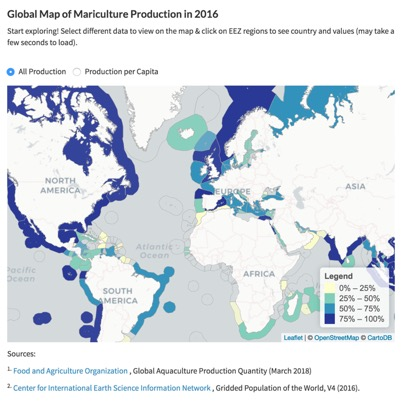
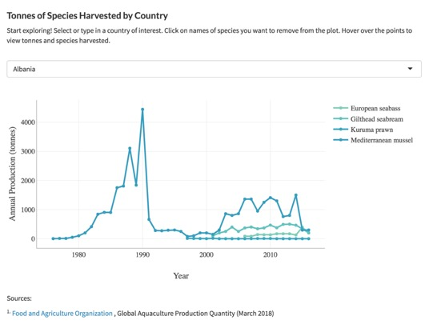

background-image: url(img/fish-background.jpg)
background-size: cover

```{r setup, include=FALSE}
options(htmltools.dir.version = FALSE)

## For installing xaringan 
#devtools::install_github('yihui/xaringan') 
```

---
name: toc

# Table of Contents

1. [Intro to the Global Dashboard](https://mazu.nceas.ucsb.edu/rstudio/files/github/global-dashboard/slidedeck/modules_slidedeck.html#intro)
2. [Structure of Repository](https://mazu.nceas.ucsb.edu/rstudio/files/github/global-dashboard/slidedeck/modules_slidedeck.html#structure)
3. [The 3 Shiny Modules](https://mazu.nceas.ucsb.edu/rstudio/files/github/global-dashboard/slidedeck/modules_slidedeck.html#modules)
4. [Sneak Peak: User Interface](https://mazu.nceas.ucsb.edu/rstudio/files/github/global-dashboard/slidedeck/modules_slidedeck.html#ui)
5. [Sneak Peak: Server](https://mazu.nceas.ucsb.edu/rstudio/files/github/global-dashboard/slidedeck/modules_slidedeck.html#server)
6. [Add a new goal section to the sidebar](https://mazu.nceas.ucsb.edu/rstudio/files/github/global-dashboard/slidedeck/modules_slidedeck.html#sidebar)
7. [Add header content for an OHI goal](https://mazu.nceas.ucsb.edu/rstudio/files/github/global-dashboard/slidedeck/modules_slidedeck.html#header)
8. [Add summary statistics](https://mazu.nceas.ucsb.edu/rstudio/files/github/global-dashboard/slidedeck/modules_slidedeck.html#stats)
9. [Add a global map](https://mazu.nceas.ucsb.edu/rstudio/files/github/global-dashboard/slidedeck/modules_slidedeck.html#map)
10. [Add a plot](https://mazu.nceas.ucsb.edu/rstudio/files/github/global-dashboard/slidedeck/modules_slidedeck.html#chart)

---
name: intro
class: middle, center

# Intro to the Global Dashboard

.footnote[Back to [Table of Contents](https://mazu.nceas.ucsb.edu/rstudio/files/github/global-dashboard/slidedeck/modules_slidedeck.html#3)]
---

## How to Use this Slide Deck

The global dashboard was created to provide OHI Global users a way to explore the data that went into calculating each of the 10 goals. 

I am not going to teach you `shiny`. You can do that on your own time. What I will do is walk you through how to add a new goal section to the global dashboard. 

There are short videos at the end of each section that summarize the content if you'd rather not read.

**Feel free to skip to any of the sections 6 through 10 if you are good at hacking your way through R and know what you're trying to do.**

---

## Main components you'll be customizing

The **UI** (`ui.R`) and **server** (`server.R`) are best friends and without telling them both that you want to create something, such as a map, your map will not generate.

The **server** is where you add custom, interactive charts and maps for each goal. The **UI** is where you specify the layout and text for those elements in your dashboard.

<br>

To prepare your OHI goal data for map or plot visualization, open a new script in the **dataprep** folder and name it something like `fis.R` or `fisheries.R`, depending on how explicit you want to be. I would stick with the acronyms OHI uses for the goals and sub-goals, but that's just me.

To see how you would need to format your data table, check out sections [9](https://mazu.nceas.ucsb.edu/rstudio/files/github/global-dashboard/slidedeck/modules_slidedeck.html#map) & [10](https://mazu.nceas.ucsb.edu/rstudio/files/github/global-dashboard/slidedeck/modules_slidedeck.html#chart).


---

## What are all these files and folders?!

Hint: read the [`README.md`](https://github.com/OHI-Science/global-dashboard/blob/master/README.md).

---
name: modules
class: middle, center

# The 3 Shiny Modules

.footnote[Back to [Table of Contents](https://mazu.nceas.ucsb.edu/rstudio/files/github/global-dashboard/slidedeck/modules_slidedeck.html#3)]
---

## Modules: Map, Chart, and Summary Statistics

.pull-left[
`map`
<br>

]

.pull-right[
`chart`
<br>

<br>

`summary_stats`
<br>

]

---

## My personal definition of a shiny module..

It represents a collection of functions that can be **reused** to create the same type of shiny element over and over.

<br>

Each of the three shiny modules in the Global Dashboard has a 1) user interface function and a 2) server-side function:

* **Summary Statistics Card**: `summary_stats_ui( )`, `summary_stats( )`
* **Map Card**: `map_ui( )`, `card_map( )`
* **Chart Card**: `card_ui( )`, `card_plot( )`

You can find these in the **modules** folder. Each module has it's own R script, named aptly.

You will see examples of the ui and server module elements in the next two sections.


---
name: ui
class: middle, center

# Sneak Peak: User Interface


.footnote[Back to [Table of Contents](https://mazu.nceas.ucsb.edu/rstudio/files/github/global-dashboard/slidedeck/modules_slidedeck.html#3)]
---

## There's a lot in the UI

but all the main components of each sidebar section will be specified inside `tabItems( )`

```{r, eval=FALSE}
tabItems(
 ## Home Page ##
   tabItem(tabName = "dashboard", # unique identifier
            frontp() # content is in front_page.R
            )

 ## Mariculture ##
    tabItem(tabName = "mar", # unique identifier
          tab_title_ui(), # header UI function
          summary_stats_ui(), # summary statistics UI module
          map_ui(), # map UI module
          card_ui() # plot UI module
          )
          
)
```

.footnote[Back to [Table of Contents](https://mazu.nceas.ucsb.edu/rstudio/files/github/global-dashboard/slidedeck/modules_slidedeck.html#3)]
---

## Notes about UI

* The UI only creates the layout, sets the text for the content, you'll need to define matching module functions in the server for the outputs to be created
* You can create as many cards, maps, baseline metrics, and title sections as you want, but I tend to avoid cluttering the shiny dashboard, so you can direct the user's attention towards specific visuals without overwhelming them
* The four different elements you just saw are created by 4 different modules. Each module has a ui function as well as a server function. Without both, you can't create the outputs you just saw in the previous slide


---
name: server
class: middle, center

# Sneak Peak: Server


.footnote[Back to [Table of Contents](https://mazu.nceas.ucsb.edu/rstudio/files/github/global-dashboard/slidedeck/modules_slidedeck.html#3)]
---

## Server, Simplified

This is the basic code that exists in the server that communicates with the ui to generate the plot, the summary statistics, and map.

```{r, eval=FALSE}
function(input, output, session) {

  callModule(card_plot, id),
  callModule(summary_stats, id),
  callModule(card_map, id)

}

```

---
name: sidebar
class: middle, center

# Add New Goal Section to the Sidebar


.footnote[Back to [Table of Contents](https://mazu.nceas.ucsb.edu/rstudio/files/github/global-dashboard/slidedeck/modules_slidedeck.html#3)]
---

## First add the sidebar tab name

Function: `menuItem( )`

Currently there are only two tabs: **The OHI Story** and **Mariculture**. To create a tab section in the side bar:

* Go to **ui.R**
* Locate `sidebarMenu( )` inside `dashboardSidebar( )`
* Uncomment and edit the goal you want to add a `menuItem( )` for

Arguments: Provide the name of the tab (e.g. **"Fisheries"**) and provide a unique ID in `tabName`. This must match the `tabName` in `tabItem( )` in the next section. I'd stick with the lower-case, OHI goal abbreviations.

```{r, eval=FALSE}
  dashboardSidebar(
    
    sidebarMenu(
       menuItem("The OHI Story", tabName = "dashboard", icon = icon("globe", lib="glyphicon")),
       menuItem("Mariculture", tabName = "mar")
      # menuItem("Tourism & Recreation", tabName = "tr"),
      # menuItem("Fisheries", tabName = "fis")
      )
  )
```


---

## Now add the page for the new section

Function: `tabItem( )`

* You should still be in **ui.R**
* Go to the `tabItems( )` section
* Create a new `tabItem( )` for your goal

Arguments: The only thing you need to do is specify `tabName` with a unique ID (I would stick with the lower-case OHI abbreviations for each goal and sub-goal)

```{r, eval=FALSE}
tabItems(

 ## Fisheries ##
    tabItem(tabName = "fis"),
    
 ## Mariculture ##
    tabItem(tabName = "mar")

)
```


---
name: header
class: middle, center

# Add Header Content


.footnote[Back to [Table of Contents](https://mazu.nceas.ucsb.edu/rstudio/files/github/global-dashboard/slidedeck/modules_slidedeck.html#3)]
---

## Don't need a module for this one

Function: `tab_title_ui( )`

* Go to **ui.R**, `tabItems( )`, then create a `tabItem( )` section
* Type in your `goal_text`, which is just the goal name in caps
* Type in the `goal_description`, a one-liner that draws people's interest
* Type in the OHI `definition` for the goal and give a bit more context about how it's calculated. 

```{r, eval=FALSE}
tabItems(
 ## Mariculture ##
    tabItem(tabName = "mar",
        
          ## Mariculture Tab Title ##
          tab_title_ui(goal_text = "MARICULTURE",
                       goal_description = "Global mariculture has been growing impressively since the 1980s, while wild-caught fishery production has remained relatively static.",
                       definition = list("Mariculture measures the ability to reach the highest levels of seafood gained from farm-raised facilities without damaging the ocean’s ability to provide fish sustainably now and in the future. You can make this as long as you want"))
          )
)
```

---
name: stats
class: middle, center

# Add Summary Statistics Module


.footnote[Back to [Table of Contents](https://mazu.nceas.ucsb.edu/rstudio/files/github/global-dashboard/slidedeck/modules_slidedeck.html#3)]
---

## UI Module

Function: `summary_stats_ui( )`

For full description of argument, see **modules/summary_stats_card.R**

* Go to **ui.R**, `tabItems( )`, `tabItem( )`
* Set the `id`, the unique id for this summary statistics shiny element (Ex: "mar_stats", "fis_stats"). This must match the id for this module on the server side (see next slide)
* Set the `number_boxes`, the number of summary statistics you want to display

```{r, eval=FALSE}
tabItems(
 ## Mariculture ##
    tabItem(tabName = "mar",
    
          ## Mariculture Baseline Metrics ##
          summary_stats_ui(id = "mar_baseline",
                               number_boxes = 3)
          )
)
```


---

## Server Module

Function: `summary_stats( )`, `callModule( )`

Change `statistic` and corresponding `text` for each iteration to allow for multiple flexibility. I used the **test/summary_stats.Rmd** script to wrangle and derive the statistics for Mariculture.

```{r, eval=FALSE}
function(input, output, session) {

## Mariculture Baseline Metrics ##
  callModule(summary_stats, "mar_baseline",
             number_boxes = 3,
             statistic = list("19%", "68%", "51%"),
             text = list("of global seafood comes from mariculture. Aquaculture, which includes marine and inland production, contributes 53% to all seafood provision.",
                         "of mariculture produced in 2016 for human consumption came from China. They are followed by South Korea at only 4%!",
                         "of mariculture is comprised of shellfish production by weight. The remaining 33% is from seaweed and 15% from fish."))

}
```

---
name: map
class: middle, center

# Add a Global Map!


.footnote[Back to [Table of Contents](https://mazu.nceas.ucsb.edu/rstudio/files/github/global-dashboard/slidedeck/modules_slidedeck.html#3)]
---

## UI Module

Function: `map_ui( )`

For full description of arguments see **modules/map_card.R**.

* `id` is a unique ID that must match the `id` in the server side of the map code
* `select_type` options are **radio** buttons, a **drop_down** menu, or **select** buttons (you need to have " " around the select type)
* `select_location` options are **above** or **below**
* `select_choices` is a vector of the categories in the column **type**
* `source_text` is to list the source of the data

```{r, eval=FALSE}
## Mariculture Global Map
          map_ui(id = "mar_global_map",
                 title_text = paste0("Global Map of Mariculture Production in ", data_yr),
                 sub_title_text = "Start exploring! Select different data to view on the map & click on EEZ regions to see country and values (may take a few seconds to load).",
                 select_type = "radio",
                 select_location = "above",
                 select_choices = c("All Production" = "prodTonnesAll",
                                    "Production per Capita" = "prodPerCap"),
                 select_label = "",
                 source_text = list(
                   p("Sources:"),
                   p(tags$sup("1."), tags$a(href="http://www.fao.org/fishery/statistics/software/fishstatj/en", "Food and Agriculture Organization"), ", Global Aquaculture Production Quantity (March 2018)"),
                   p(tags$sup("2."), tags$a(href="http://sedac.ciesin.columbia.edu/data/collection/gpw-v4/documentation","Center for International Earth Science Information Network"), ", Gridded Population of the World, V4 (2016).")
                   )
                 )
```

---

## Server Module

Function: `card_map( )`, `callModule( )`

The global map module can take multiple types of data to plot as long as the data table is set up right. Make sure you have a column called **type** that lists the categories of data you want to plot. See how the `mar_global_map` was created in **dataprep/mar.R**.

```{r, eval=FALSE}
## Mariculture Global Map ##
  callModule(card_map, "mar_global_map",
             data = mar_global_map,
             field = "input",
             filter_field = type, # type of data to plot
             display_field = "map_data",
             display_units = "units",
             color_palette = ygb,
             legend_title = "Legend",
             popup_title = "country")
```


---

## Set-up of the data table

The wrangling of the mariculture data was done in **dataprep/mar.R**. Create a new script for each new goal. 

Test `leaflet` map code in **test/test_global_map.Rmd**.

```{r, eval=FALSE}
> head(mar_global_map, 15)
# A tibble: 15 x 6
   rgn_id country           type     map_data units Taxon    
    <dbl> <chr>             <chr>       <dbl> <chr> <fct>    
 1   82.0 Albania           prodTon…    700   tonn… Fish     
 2   82.0 Albania           prodTon…    700   tonn… Crustace…
 3   82.0 Albania           prodTon…    700   tonn… Bivalve …
 4   84.0 Algeria           prodTon…    364   tonn… Crustace…
 5   84.0 Algeria           prodTon…    364   tonn… Fish     
 6   84.0 Algeria           prodTon…    364   tonn… Bivalve …
 7  151   American Samoa    prodTon…     NA   tonn… NA       
 8   92.0 Amsterdam Island… prodTon…     NA   tonn… NA       
 9   26.0 Andaman and Nico… prodTon…     NA   tonn… NA       
10  200   Angola            prodTon…     NA   tonn… NA       
11  118   Anguilla          prodTon…     NA   tonn… NA       
12  120   Antigua and Barb… prodTon…     NA   tonn… NA       
13  172   Argentina         prodTon…     16.2 tonn… Bivalve …
14  250   Aruba             prodTon…     NA   tonn… Bivalve …
15   85.0 Ascension         prodTon…     NA   tonn… NA  
```

---
name:chart
class: middle, center

# Add a Plot


.footnote[Back to [Table of Contents](https://mazu.nceas.ucsb.edu/rstudio/files/github/global-dashboard/slidedeck/modules_slidedeck.html#3)]
---

## UI Module

Function: `card_ui( )`

For full description of argument definitions, see **modules/chart_card.R**.

* `select_type` options are **radio**, **drop_down**, **select**, or **search**
* `select_location` options are **below** or **above**
* `select_choices` is a vector of values that you want the user to be able to selet from (e.g. list of countries)

```{r, eval=FALSE}
card_ui(id = "mar_prod",
        title_text = "Tonnes of Species Harvested by Country",
        sub_title_text = "Start exploring! Select or type in a country of interest. Click on names of species you want to remove from the plot. Hover over the points to view tonnes and species harvested.",
        select_type = "search",
        select_location = "above",
        select_choices = unique(mar_harvest$country),
        select_label = NULL,
        source_text = list(
                      p("Sources:"),
                      p(tags$sup("1."), tags$a(href="http://www.fao.org/fishery/statistics/software/fishstatj/en", "Food and Agriculture Organization"), ", Global Aquaculture Production Quantity (March 2018)"))
                     )
```
---

## Server Module

Function: `card_plot( )`, `callModule( )`
This is the module that creates plots. The current options for plots include: bar graph, line graph, or scatterplot. This can be customized in the **modules** folder.

* `df` is the name of the wrangled data table
* `filter_field` is the column that gets filtered when the user is selecting different options. Should match with `select_choices`
* `colors` is a set color palette defined in **global.R**

For a **bar chart**, set `plot_type` to **"bar"**, for a **line graph**, set `mode` to **"lines+markers"**, and for a **scatter**, set `mode` to **"markers"**

```{r, eval=FALSE}
## Mariculture Production ##
  callModule(card_plot, "mar_prod",
             df = mar_harvest,
             x = "year",
             y = "tonnes",
             color_group = "species",
             filter_field = "country",
             colors = cols,
             plot_type = "scatter",
             mode = "lines+markers",
             tooltip_text = ~paste("Tonnes:", tonnes,
                                   "<br>Species:", species, sep=" "),
             xaxis_label = "Year",
             yaxis_label = "Annual Production (tonnes)")
```

---

## Set-up of data table

Check out how `mar_harvest` was set up in **dataprep/mar.R**. 

```{r, eval=FALSE}
> head(mar_harvest,15)
   rgn_id country           species Taxon_code year tonnes Taxon
1      82 Albania  European seabass          F 2006   87.0  Fish
2      82 Albania  European seabass          F 2007   84.0  Fish
3      82 Albania  European seabass          F 2008  142.0  Fish
4      82 Albania  European seabass          F 2009  135.0  Fish
5      82 Albania  European seabass          F 2010  135.0  Fish
6      82 Albania  European seabass          F 2011  170.0  Fish
7      82 Albania  European seabass          F 2012  170.0  Fish
8      82 Albania  European seabass          F 2013  170.0  Fish
9      82 Albania  European seabass          F 2014  129.4  Fish
10     82 Albania  European seabass          F 2015  392.0  Fish
11     82 Albania  European seabass          F 2016  200.0  Fish
12     82 Albania Gilthead seabream          F 2001  100.0  Fish
13     82 Albania Gilthead seabream          F 2002  200.0  Fish
14     82 Albania Gilthead seabream          F 2003  250.0  Fish
15     82 Albania Gilthead seabream          F 2004  400.0  Fish
```
---
name: conclude
class: middle, center

# Enjoy!
